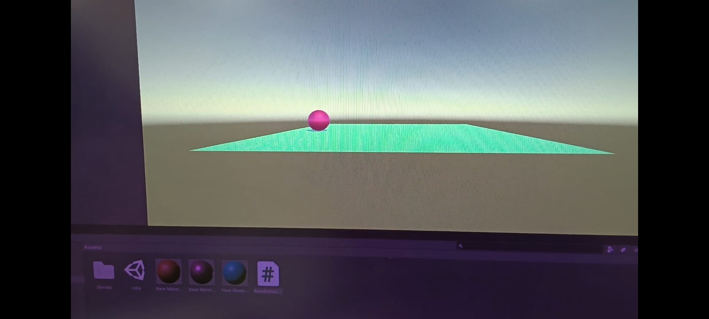
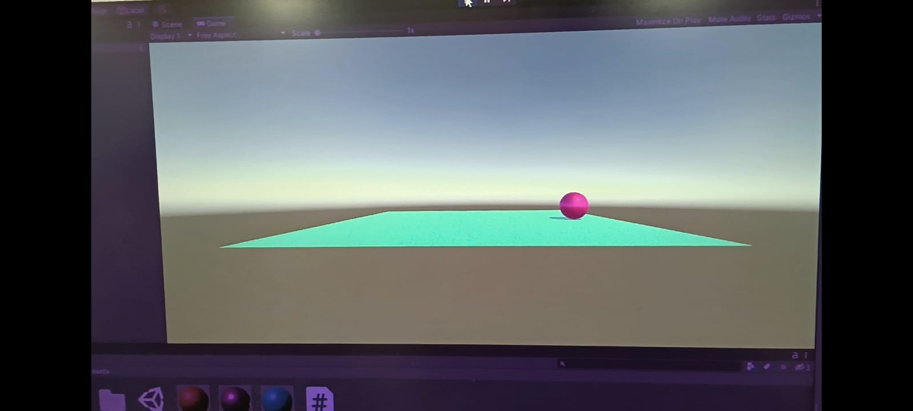
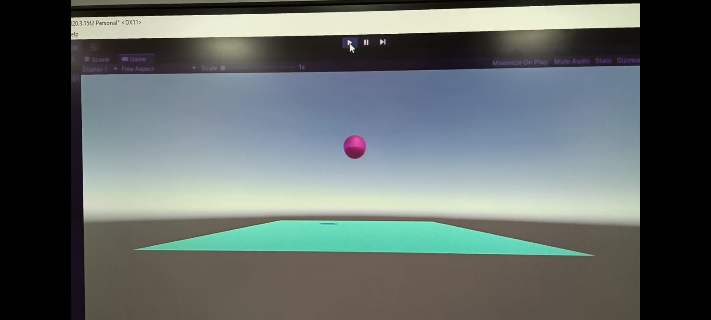
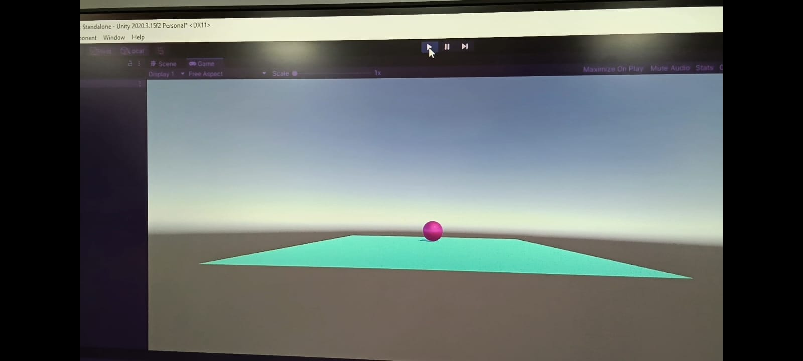

#  EX.NO : 02 RollaBall

## Aim:
### STEP 1:
To Create a unity project in unity hub.
### STEP 2:
Aftern creating Click File -> Scene -> Select the scene -> Save as-> New folder(Scenes)-> File name (Expno2).
### STEP 3:
Click Hierarchy -> 3DObject -> Sphere Hierarchy -> 3DObject -> plane Hierarchy.
### STEP 4:
Create a folder in project and name as Materials Material folder -> Create -> Material (Name: Sphere) Inspector ->Surface Inputs ->BaseMAp (Choose the color) Drag the Cylinder to the plane and release the mouse
### STEP 5:
Create a folder name Coding and create a C# file to add the coding in it.
### STEP 6:
To add our C# Script file to our selected object, click on the C# Script file and drag it to Sphere objects in the Hierarchy window and run the application.
### STEP 7:
After run the application, you press the WASD and space key the ball will move and jump.
### STEP 8:
Save the unity file and take screenshot.
### STEP 9:
Close the Unity project.
## Algorithm:

1. File -> Scene -> Select the scene -> Save as-> New folder(Scenes)-> File name (MiniGame)

2. Heirarchy -> 3D Object-> Plane 
[ Right side-> Inspector-> Change the name of plane (Name: Ground)
Transform -> Reset
Edit -> FrameSelected ]

3. Scale the ground by giving the scaling value as x=4 y=1 z=4

4. Heirarchy -> 3D Object-> Sphere
[ Right side-> Inspector-> Change the name of plane (Name: Player)
Transform -> Reset
Edit -> FrameSelected 
Transform -> Position -> y=0.5]

5. Hierarchy -> DirectionalLight
[ Inspector -> Change the color to white (255,255,255)]

6. Create a folder in project and name as Materials
[Material folder -> Create -> Material (Name: Background)
Inspector ->Surface Inputs ->BaseMAp (Choose the color)
Metallic map-> 0
Smoothness -> 0.25
Drag the Background to the plane and release the mouse

Material folder -> Create -> Material (Name: Sphere)
Inspector ->Surface Inputs ->BaseMAp (Choose the color)
Metallic map-> 0
Smoothness -> 0.75
Drag the Sphere material to the ball and release the mouse

 7. Hierarchy -> Player-> Inspector ->Add component-> Rigidbody

8. Create a new script -> Create a folder in project (Name: Scripts)
Hierarchy -> Player -> Inspector-> AddComponent-> NewScripts-> PlayerController( Click create and Add)
Copy the PlayerController and drag to Script folder
Double click the PlayerController file and type the coding

## Program:
~~~
DEVELOPED BY : MEIYARASI V
REGISTER NUMBER : 212221230058
~~~
~~~
using System.Collections;
using System.Collections.Generic;
using UnityEngine;

public class NewBehaviourScript : MonoBehaviour
{
    public float xforce = 5.0f;
    public float yforce = 200.0f;
    public float zforce = 5.0f;

    // Start is called before the first frame update
    void Start()
    {
        
    }

    // Update is called once per frame
    void Update()
    {
        float x = 0.0f;
        float y = 0.0f;
        float z = 0.0f;
    if(Input.GetKey(KeyCode.A))
        {
        x =x-xforce;
        }
    if (Input.GetKey(KeyCode.D))
{
    x = x + xforce;
}
    if (Input.GetKey(KeyCode.W))
{
    z = z + zforce;
}
    if (Input.GetKey(KeyCode.S))
{
    z = z - zforce;
}
    if (Input.GetKeyDown(KeyCode.Space))
{
    y = yforce;
}
GetComponent<Rigidbody>().AddForce(x, y, z);
        
    }
}
~~~

## Output:

## Result:
Thus, The 3D application for Roll the Ball objects in unity is developed successfully